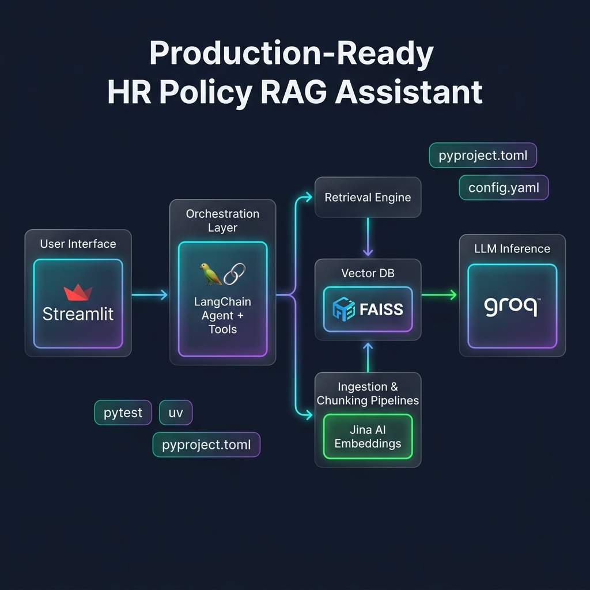

# 🏢 HR Policy RAG Assistant

An end-to-end **Retrieval-Augmented Generation (RAG)** system built with **LangChain**, **Jina AI Embeddings**, **FAISS**, **Groq LLM**, and **Streamlit** to provide fast, contextual Q&A over HR policy documents.


*(Note: Upload the generated architecture diagram to a `docs/` folder to display it here on GitHub)*

---

## 📌 Features

* **Data Ingestion:** Supports text documents, JSON, Excel, and structured policy files.
* **Document Chunking:** Configurable text splitting (Character and Recursive Splitters) for accurate chunk retrieval.
* **Vector Embeddings:** Uses **Jina AI Embeddings** to generate dense semantic vector representations.
* **Vector Database:** Fast similarity search with **FAISS**.
* **LLM Inference:** Ultra-low latency responses powered by **Groq** (`openai/gpt-oss-120b`).
* **Web UI:** Interactive Streamlit web application.
* **Configurable:** Centralized `config.yaml` for easy tuning without touching code.

---

## 🔒 Security Notice

> ⚠️ **IMPORTANT:** Never expose or commit real API keys or `.env` files to GitHub.
> 
> The `.gitignore` file is configured to ignore all `.env` files. Copy `.env.example` to `.env` locally and populate your secret keys.

---

## 📂 Project Structure

```text
hr-policy-rag-assistant/
├── Basic_RAG_experimental/         # Experimental RAG pipeline & research (Jupyter notebooks)
├── Production_RAG/                 # Production-ready modular RAG system
│   ├── app.py                      # Streamlit UI Entry Point
│   ├── main.py                     # Alternative CLI entry point
│   ├── config.py                   # Loads environment variables & config.yaml
│   ├── config.yaml                 # Application settings (model, chunk size, top_k)
│   ├── pipeline.py                 # Wires components together
│   ├── agent.py                    # LangChain Agent initialization
│   ├── tools.py                    # LangChain tool definitions
│   ├── chunking/                   # Text splitting logic
│   ├── embeddings/                 # Jina embeddings integration
│   ├── ingestion/                  # Document loaders
│   ├── llm/                        # Groq LLM client
│   ├── prompts/                    # System prompts and templates
│   ├── retrieval/                  # FAISS retrieval logic
│   ├── vectordb/                   # Vector store build/save/load
│   ├── pyproject.toml              # Python package configuration
│   ├── .env.example                # Environment variables template
│   └── tests/                      # Pytest suite
└── README.md                       # Project documentation
```

---

## 🚀 Quick Start

### Prerequisites
* **Python 3.14.6** is required.
* API Keys for **Groq** and **Jina AI**.

### 1. Clone the Repository
```bash
git clone https://github.com/narendhar11/hr-policy-rag-assistant.git
cd hr-policy-rag-assistant
```

### 2. Create & Activate Virtual Environment (If using pip)
*(Note: If you use `uv` in Step 3, you can skip this step!)*

```bash
# macOS / Linux
python3 -m venv basicragenv
source basicragenv/bin/activate

# Windows
python -m venv basicragenv
basicragenv\Scripts\activate
```

### 3. Install Dependencies
Since the production app uses a modern `pyproject.toml`, you can install it using standard `pip` or the lightning-fast `uv` package manager:

**Option A: Using `uv` (Recommended for speed)**
`uv` automatically creates a virtual environment (`.venv`) for you and installs everything instantly.
```bash
# If you don't have uv installed: pip install uv
cd Production_RAG
uv sync
```

**Option B: Using standard `pip`**
```bash
cd Production_RAG
pip install -e .
```

### 4. Configure Environment Variables
Create your local `.env` file from the example template:
```bash
cd Production_RAG
cp .env.example .env
```

Open `Production_RAG/.env` and set your API keys:
```env
GROQ_API_KEY=your_groq_api_key_here
JINA_API_KEY=your_jina_api_key_here
```

### 5. Run the Application
Launch the Streamlit web interface:

**If you used `uv`:**
```bash
cd Production_RAG
uv run streamlit run app.py
```

**If you used `pip` (with an activated virtual environment):**
```bash
cd Production_RAG
streamlit run app.py
```

---

## 🛠️ Configuration (`config.yaml`)

You can tune the RAG pipeline easily by modifying the `config.yaml` file in the `Production_RAG` directory. No Python code changes are required!

```yaml
llm:
  model: "openai/gpt-oss-20b"
  temperature: 0

embeddings:
  model: "jina-embeddings-v2-base-en"

chunking:
  chunk_size: 500
  chunk_overlap: 50

retrieval:
  top_k: 3
```

---

## 🧪 Testing

The project includes a `pytest` suite for smoke testing the pipeline configuration.
Run tests from the root directory:
```bash
pytest Production_RAG/tests/
```

---

## 📜 License

Distributed under the MIT License.
