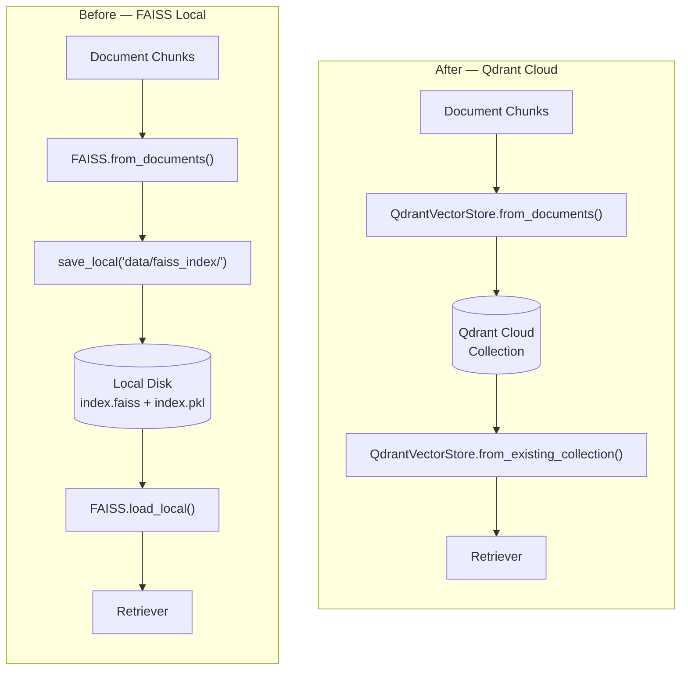

# 04. Migrating from Local FAISS to Cloud Qdrant

**Branch:** `migrating-vectors-cloud`

## Why migrate?

FAISS (Facebook AI Similarity Search) stores vector indexes as **local files** on
disk (`data/faiss_index/`). That works fine on a single developer laptop but
breaks down in production:

| Concern | FAISS (local) | Qdrant (cloud) |
|---------|---------------|-----------------|
| **Persistence** | Files on disk — lost if the container restarts without a volume | Managed cloud storage — data survives deployments |
| **Scalability** | Single-machine, in-memory | Horizontally scalable, cluster-ready |
| **Multi-instance** | Each replica needs its own copy of the index | All replicas query the same cloud collection |
| **Backup & recovery** | Manual `cp` / `rsync` | Built-in snapshots via Qdrant Cloud dashboard |
| **Deployment size** | Index files inflate Docker images | Index lives externally; image stays lean |

In short: **local FAISS is great for prototyping; Qdrant Cloud is built for
production workloads.**

---

## What is Qdrant?

Qdrant is an open-source vector similarity search engine. It provides a
production-ready service with a convenient API to store, search, and manage
vectors with additional payloads. Qdrant Cloud is their fully managed hosting —
no infrastructure to maintain.

Key features we use:
- **Collections** — named groups of vectors (our equivalent of the old
  `faiss_index/` folder)
- **REST + gRPC API** — `qdrant-client` talks to the cloud endpoint
- **LangChain integration** — `langchain-qdrant` wraps everything behind the
  same `VectorStore` interface our retriever already expects

---

## What changed in the codebase

### 1. New dependencies

```toml
# pyproject.toml
[project]
dependencies = [
    ...
    "langchain-qdrant>=1.1.0",
    "qdrant-client>=1.19.0",
]
```

`faiss-cpu` is no longer required (can be removed if nothing else depends on it).

### 2. New environment variables

Three new secrets are needed in your `.env` file:

```bash
# .env
QDRANT_URL=https://<your-cluster>.cloud.qdrant.io:6333
QDRANT_API_KEY=<your-qdrant-api-key>
QDRANT_COLLECTION_NAME=hr_policy_collection
```

The old `VECTOR_STORE_PATH` variable is no longer used and has been removed from
`config.py`.

### 3. Config changes (`config.py`)

```diff
 # ── Paths ──────────────────────────────────────────────────────────────────────
 DATA_FILE_PATH    = os.getenv("DATA_FILE_PATH", str(_BASE_DIR / "data" / "hr_policies.txt"))
-VECTOR_STORE_PATH = os.getenv("VECTOR_STORE_PATH", str(_BASE_DIR / "data" / "faiss_index"))

+# ── Cloud Vector (Qdrant) ──────────────────────────────────────────────────────
+QDRANT_API_KEY         = os.getenv("QDRANT_API_KEY")
+QDRANT_URL             = os.getenv("QDRANT_URL")
+QDRANT_COLLECTION_NAME = os.getenv("QDRANT_COLLECTION_NAME")
```

### 4. Vector store module (`vectordb/vector_store.py`)

This is the core of the migration. Three functions were updated:

#### `build_vector_store(chunks)`

**Before (FAISS):**
```python
from langchain_community.vectorstores import FAISS

def build_vector_store(chunks):
    embeddings = get_embeddings_model()
    return FAISS.from_documents(chunks, embeddings)
```

**After (Qdrant):**
```python
from langchain_qdrant import QdrantVectorStore

def build_vector_store(chunks):
    embeddings = get_embeddings_model()
    return QdrantVectorStore.from_documents(
        chunks,
        embedding=embeddings,
        url=config.QDRANT_URL,
        api_key=config.QDRANT_API_KEY,
        collection_name=config.QDRANT_COLLECTION_NAME,
    )
```

> **Key difference:** FAISS builds an in-memory index that you must explicitly
> `save_local()`. Qdrant persists vectors to the cloud **immediately** during
> `from_documents()` — no separate save step needed.

#### `save_vector_store()` — **Removed**

This function called `vector_store.save_local(path)` to write the FAISS index
to disk. With Qdrant, data is persisted automatically on write, so this function
is no longer needed and has been deleted.

#### `load_vector_store()`

**Before (FAISS):**
```python
def load_vector_store(path=config.VECTOR_STORE_PATH):
    embeddings = get_embeddings_model()
    return FAISS.load_local(path, embeddings, allow_dangerous_deserialization=True)
```

**After (Qdrant):**
```python
def load_vector_store():
    embeddings = get_embeddings_model()
    return QdrantVectorStore.from_existing_collection(
        embedding=embeddings,
        url=config.QDRANT_URL,
        api_key=config.QDRANT_API_KEY,
        collection_name=config.QDRANT_COLLECTION_NAME,
    )
```

> Notice: No `path` parameter — the collection is identified by name, not a
> filesystem path. Also, no `allow_dangerous_deserialization` flag — Qdrant
> doesn't use Python pickle, so there's no deserialization risk.

#### `vector_store_exists()`

**Before (FAISS):**
```python
def vector_store_exists(path=config.VECTOR_STORE_PATH):
    return os.path.isfile(os.path.join(path, "index.faiss"))
```

**After (Qdrant):**
```python
def vector_store_exists():
    client = QdrantClient(url=config.QDRANT_URL, api_key=config.QDRANT_API_KEY)
    return client.collection_exists(config.QDRANT_COLLECTION_NAME)
```

### 5. Pipeline changes (`pipeline.py`)

- `save_vector_store(vector_store)` call removed (Qdrant auto-persists)
- `save_vector_store` import removed
- Log messages updated to reference Qdrant collection names instead of file
  paths

### 6. `__init__.py` exports updated

`save_vector_store` removed from both `vectordb/__init__.py` imports and
`__all__` exports.

### 7. Tests rewritten (`tests/test_vectordb.py`)

All four tests were rewritten to mock Qdrant APIs instead of FAISS local-file
operations:

| Old test | New test |
|----------|----------|
| Check `index.faiss` file exists on disk | Mock `QdrantClient.collection_exists()` |
| `save_vector_store` calls `save_local()` | **Deleted** — function no longer exists |
| `load_vector_store` calls `FAISS.load_local()` | Mock `QdrantVectorStore.from_existing_collection()` |
| *(none)* | `build_vector_store` calls `QdrantVectorStore.from_documents()` |

---

## Architecture: Before vs After



> Notice the **save step is gone** in the Qdrant flow — `from_documents()`
> writes directly to the cloud.

---

## How to set up Qdrant Cloud

1. **Create a free account** at [cloud.qdrant.io](https://cloud.qdrant.io)
2. **Create a cluster** — the free tier gives you a 1 GB cluster
3. **Get your credentials:**
   - **URL** — shown on the cluster dashboard (e.g., `https://xyz.cloud.qdrant.io:6333`)
   - **API Key** — generated in the cluster's "API Keys" section
4. **Add to `.env`:**
   ```bash
   QDRANT_URL=https://xyz.cloud.qdrant.io:6333
   QDRANT_API_KEY=your-api-key-here
   QDRANT_COLLECTION_NAME=hr_policy_collection
   ```
5. **Run the app** — the collection is created automatically on first
   `build_vector_store()` call:
   ```bash
   uv run streamlit run app.py
   ```

---

## Files changed in this migration

| File | What changed |
|------|-------------|
| `pyproject.toml` | Added `langchain-qdrant`, `qdrant-client` |
| `config.py` | Added `QDRANT_*` vars, removed `VECTOR_STORE_PATH` |
| `vectordb/vector_store.py` | Rewrote all functions from FAISS to Qdrant |
| `vectordb/__init__.py` | Removed `save_vector_store` export |
| `pipeline.py` | Removed save call, updated logs |
| `retrieval/retriever.py` | Docstring update only (retriever logic unchanged) |
| `retrieval/__init__.py` | Docstring update only |
| `app.py` | UI sidebar: FAISS → Qdrant |
| `tests/test_vectordb.py` | Full rewrite to mock Qdrant APIs |

---

## Rollback plan

If you need to revert to FAISS:

1. `git checkout` the previous branch
2. Remove `QDRANT_*` variables from `.env`
3. Restore `VECTOR_STORE_PATH` in `config.py`
4. Run the app — it will rebuild the local FAISS index from documents

The Qdrant Cloud collection can be deleted from the dashboard at any time; it
does not affect the local codebase.
